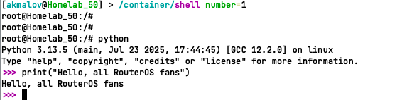

# Simple setup for launching containers

Main wiki - https://help.mikrotik.com/docs/display/ROS/Container

## Info

> [!NOTE]  
> External disk is highly recommended  (USB or SSD disk) or use network storage drive (SMB, NFS, etc.)


> [!WARNING]  
> **Security risks:**
> 
> Running an obscure container image on your router can open a security breach
> 
> If the router is hacked, the containers can be used to easily install malicious software on your router and over the network


## Quick Start

First, let's check if container mode is enabled.
```routeros
/system/device-mode/print 
```

If not, then turn on (turn it off and on by power supply):
```routeros
/system/device-mode/update container=yes
```

Quick setup instructions
```routeros
# Create bridge for containers
/interface/bridge/add name=br-container 
/ip/address/add address=10.200.0.1/24 interface=br-container 
# Virtual Ethernet interface for Docker containers
/interface/veth/add name=veth1 address=10.200.0.10/24 gateway=10.200.0.1 
/interface/bridge/port/add bridge=br-container interface=veth1 
```

Creating a container sysbench
```routeros
/container/add remote-image=mirror.gcr.io/zyclonite/sysbench cmd="--test=cpu --threads=1 run" interface=veth1 logging=yes name=sysbench root-dir=docker/sysbench 
```

Next, we start the container and check the results in the logs

## Container registry

```shell
/container/config/set registry-url=https://registry-1.docker.io tmpdir=/usb1/tmp
```

Registry
- docker.io
- mirror.gcr.io (docker mirror)
- ghcr.io (github registry)

use the appropriate registry by writing the full name of the container path

`mirror.gcr.io` + `traefik:3.5.0` result: `mirror.gcr.io/traefik:3.5.0`

- 

### Example commands

Start blank nginx
```shell
/container/add remote-image=nginx:latest interface=veth1 root-dir=usb1/docker/nginx logging=yes
```

python image for debug and shell exec
```
# download python image and configure
/container/add remote-image=mirror.gcr.io/python:3.13.5-slim interface=veth1 root-dir=docker/python logging=yes cmd="tail -f /dev/null"
# run container
/container/start nuber=X
# exec shell
/container/shell number=X
```


